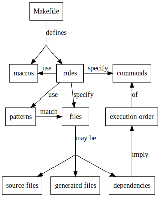

# Make for Reproducible Analysis

<!-- -------------------------------------------------------------------------------- -->

## Step 1: Brainstorming

1. What problem(s) will student learn how to solve?
   - How to write Makefiles to re-run data analyses.
   - How to use pattern rules to make their Makefiles more powerful.
   - How to use macros to parameterize their Makefiles.
2. What techniques or concepts will students learn?
   - Dependencies.
   - Rules.
   - Automatic variables.
   - Pattern rules.
   - Choosing easy-to-match filenames.
3. What technologies, packages, or functions will students use?
   - GNU Make.
4. What terms or jargon will you define?
   - "rule"
   - "dependency"
   - "pattern"
   - "macro"
5. What mistakes or misconceptions do you expect?
   - When patterns are matched to files.
8. What datasets will you use?
   - Synthesized.



<!-- -------------------------------------------------------------------------------- -->

## Step 2: Who is this lesson for?

- [Anya](https://github.com/datacamp/learner-profiles#anya)
  started using Make in her first C programming course twenty years ago,
  but has never used it to automate data analysis.
  This course will show her some new tricks and spark some new ideas.
- [Thanh](https://github.com/datacamp/learner-profiles#thanh)
  has never seen Make before.
  He currently re-runs analyses with RStudio scripts,
  but now that he's getting hundreds of new datasets each week,
  he would like to re-run only the calculations he needs to.
  This course will show him how to do that.

<!-- -------------------------------------------------------------------------------- -->

## Step 3: How far will this lesson get its learners?

The directory `dosage` contains sub-directories whose names are patient IDs
like `AC1071` and `DN2249`.
Each sub-directory contains one or more CSV data files whose names are ISO dates
(e.g, `dosage/AC1071/2017-10-02.csv`)
and whose contents are formatted like this:

```
Time,Dosage (mg)
03:45,30
07:30,30
11:50,60
16:10,30
04:00,20
09:55,100
13:20,20
17:00,100
```

Another directory called `daily` contains one CSV file per patient with daily total dosages,
e.g. `daily/AC1071.csv` contains:

```
Date,Total Dosage (mg)
2017-10-02,1500
2017-10-09,1350
2017-10-16,1200
```

A single file in the root directory called `averages.csv`
records the average daily dose per patient with the duration in dates of the dosage period,
e.g.:

```
Patient ID,Dosage Duration,Average Daily Dosage (mg)
AC1071,61,1422.5
DN2249,55,1190.0
```

The directory `bin` contains three analysis scripts:

1. `bin/patient-total -o output-file file-1 file-2 ...` reads data from one or more raw dosage files
   (like those in `dosage/AC1071/*.csv`)
   and re-creates that patient's total daily dosage file
   (e.g., `daily/AC1071.csv`).
2. `bin/patient-average -o output-file file-1 file-2` reads one or more daily dosage files
   (like `daily/AC1071.csv` and `daily/DN2249.csv`)
   and re-creates an average daily dosage file `results/averages.csv`.

New daily dosage files are being added to existing patient directories all the time,
and new patient directories are being created weekly.
Write a Makefile that correctly regenerates the file in the `results` directory
every time any new data is added.
Do only those computations that are strictly required.

> **Solution**
>
> ```
> STEMS=$(notdir $(wildcard dosage/*))
> DAILY=$(patsubst %,daily/%.csv,${STEMS})
>
> averages.csv : ${DAILY}
> 	bin/patient-average -o $@ ${DAILY}
>
> daily/%.csv : dosage/%/*.csv
> 	mkdir -p daily
> 	bin/patient-total -o $@ $^
> ```

<!-- -------------------------------------------------------------------------------- -->

## Step 4: What will the learner do along the way?

1. Do analysis by hand.
   - Run `bin/patient-total`, `bin/patient-average`, and `bin/scatter` by hand
     to trace the calculations for one patient.

1. Recalculate one patient's data.
   - Write a Make rule to run `bin/patient-total` to recreat the daily dosage file for one patient.
   - Use `touch` on the source file to trigger rule execution for testing.
   - Add a new raw dosage file for that patient and check that the rule runs.

1. Recalculate dependent files.
   - Add a rule to regenerate `results/averages.csv`.
   - Use `touch` to check that programs only run when they need to.
   - Trigger the whole execution chain by adding a new raw dosage file.

1. Use automatic variables.
   - Rewrite existing rules using `$@`, `$^`, and `$<`.

1. Create a tree of dependencies (instead of a linear chain).
   - Add a rule to regenerate `daily/AC1433.csv`.
   - Modify the rule for `results/averages.csv` so that it is updated when it needs to be.
   - Test using `touch` and by adding more data files.
   - See what happens when a daily dosage file is *removed* (answer: nothing).

1. Write a pattern rule.
   - Write a wildcard pattern rule to replace the separate rules for `AC1071` and `AC1433`.
   - Test by adding more data files for each patient.
   - Test again by adding an entirely new patient.

1. Include all dependencies.
   - Modify rules to re-run when their scripts change.

1. Use dummy targets.
   - Write a phony `clean` target.
   - Write a phony `test` target.

1. Use macros.
   - Replace names of input and output directories with macros.
   - Override those macros with command-line definitions.

<!-- -------------------------------------------------------------------------------- -->

## Step 5: How are the concepts connected?

- Simple Rules
  - What is Make?
  - What does a simple rule contain?
  - What are automatic variables?
- Dependencies
  - What is a dependency?
  - How does Make decide which commands to run when?
- Writing Better Rules
  - What is a pattern rule?
  - What is a macro?
  - How can we make execution depend on changes to scripts?
- Configuration
  - How can we use functions to construct sets of files?
  - How can we use command-line parameters to control Make?

The code and datasets are:

- Dosage files.
  - And a Python script to generate random dosage files.
- Python scripts to process dosage files.

<!-- -------------------------------------------------------------------------------- -->

## Step 6: How will learners find the course and know if it's for them?

**Course Description**

Make is a tool that keeps track of which files depend on which others,
and updates any files that have fallen out of date.  Originally
invented to help programmers manage complex programs, it is now used
by data analysts to make complex workflows reproducible.  This lesson
will show you how to use core features of Make.

**Learning Objectives**

- Explain what problems Make solves and why it is better than handwritten scripts.
- Identify the targets, dependencies, and actions of rules.
- Trace the execution order of rules in a short Makefile.
- Use automatic variables to shorten rules.
- Use wildcards to write pattern rules.
- Use macros and functions to make Makefiles more readable.
- Use include files and command-line parameters to configure Make.

**Prerequisites**

- Introduction to the Unix Shell for Data Scientists
